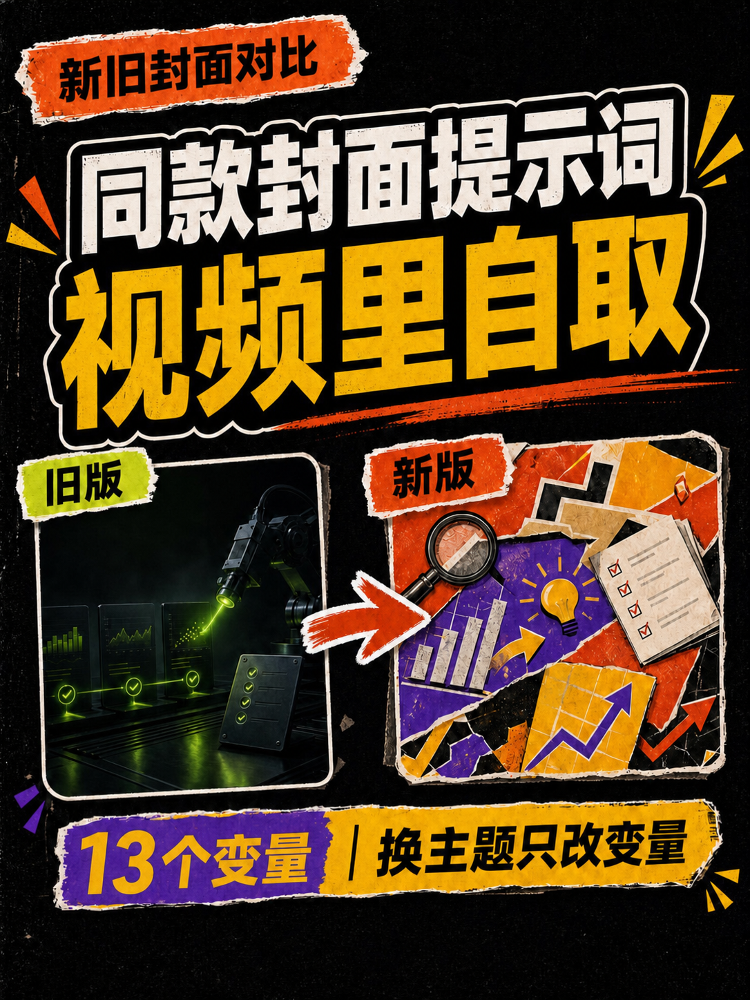

# 一段口播稿，直接变成能用的抖音封面

`generate-douyin-cover` 是一个面向中文短视频创作者的 Codex Skill。

你只需要丢进去一段口播稿，它会先读懂这条视频真正的冲突、证据和结果，再判断应该使用流程型、对比型还是证据型构图，最后生成一张适合抖音主页缩略图阅读的 **3:4 封面**。

它解决的不是“再帮你写一条更长的提示词”，而是把一次次碰运气，变成一套可以反复使用的封面工作流。

## 真实生成效果

下面这张封面来自一次真实测试。输入不是设计稿，而是一段讲“封面生成能力做成 Skill”的口播文案：

> 家人们，我用 AI 做视频封面的能力，又又又更新了！  
> 这次做成了 Skill。直接跑一次给你们看。

Skill 自动选择了流程型构图，并完成标题提炼、参考图选择、提示词生成、准确中文排版和安全区检查。

<p align="center">
  
</p>

## 它能帮你做什么

- 从口播稿中提取一个最值得放大的冲突，不把整篇文案塞进封面。
- 在 `process`、`comparison`、`evidence` 三种构图中自动选择一种。
- 根据内容关系只选择一张匹配的 Few-shot 参考图，避免多张参考图把构图“平均”成普通海报。
- 有生图能力时，生成背景并使用程序叠加准确中文。
- 没有生图能力时，输出可以复制到豆包等工具中的完整提示词包。
- 检查文字重叠、裁切、缩略图可读性和抖音右侧交互安全区。
- 记住当前项目的账号名和候选图数量，但不会把项目 A 的配置带进项目 B。
- 用户连续不满意时，自动把默认输出升级为两张明显不同的候选图。

## 三种构图，不是三套死模板

<table>
  <tr>
    <td width="33%" align="center"><strong>流程型</strong></td>
    <td width="33%" align="center"><strong>对比型</strong></td>
    <td width="33%" align="center"><strong>证据型</strong></td>
  </tr>
  <tr>
    <td></td>
    <td></td>
    <td></td>
  </tr>
  <tr>
    <td>适合工作流、清单、整理过程和从乱到清楚的变化。</td>
    <td>适合新旧、前后、对错和两个方案之间的选择。</td>
    <td>适合多份报告、测试或数据共同指向一个结论。</td>
  </tr>
</table>

这些图片是已经去除账号名的构图参考，不是让模型照抄其中的文字。Skill 会根据当前口播稿重新生成标题、证据和视觉对象。

## 快速安装

### 1. 克隆仓库

```bash
git clone https://github.com/apoptoxin/t2i_skill.git
cd t2i_skill
```

### 2. 链接到 Codex Skills 目录

macOS / Linux：

```bash
mkdir -p ~/.codex/skills
ln -sfn "$(pwd)" ~/.codex/skills/generate-douyin-cover
```

也可以直接把仓库复制到：

```text
~/.codex/skills/generate-douyin-cover
```

### 3. 检查运行环境

```bash
python3 ~/.codex/skills/generate-douyin-cover/scripts/doctor.py \
  --skill-root ~/.codex/skills/generate-douyin-cover
```

如果缺少 Pillow：

```bash
python3 -m pip install -r \
  ~/.codex/skills/generate-douyin-cover/requirements.txt
```

## 在 Codex 里怎么用

安装完成后，可以直接说：

```text
使用 $generate-douyin-cover，把下面这段口播稿做成抖音封面：

……你的口播稿……
```

第一次在某个项目里使用时，Skill 只会确认三件事：

1. 封面是否显示账号名；
2. 显示什么账号名；
3. 默认生成一张还是两张候选图。

配置保存在当前项目的 `.cover-skill/config.json` 中。Skill 虽然可以全局安装，但每个项目都必须独立初始化，避免不同账号之间串配置。

## 最终会得到什么

### 有图片生成能力

通过检查后会得到：

```text
cover.png
cover-variables.json
cover-prompt.txt
negative-prompt.txt
layout-spec.md
cover-candidate.manifest.json
```

其中 `cover.png` 只会在正式检查通过后生成。检查失败的图片仍叫 `cover-candidate.png`，不会假装成最终成品。

### 没有图片生成能力

Skill 会进入 `prompt_only` 模式，输出：

```text
cover-variables.json
cover-prompt.txt
negative-prompt.txt
layout-spec.md
```

把提示词和对应参考图交给豆包等生图工具，即可继续生成；Skill 不会用一张空白占位图冒充封面。

## 为什么中文不会总是写错

这套流程把“构图”和“文字”拆开处理：

1. 生图模型只负责撕纸、错位、遮叠、箭头、材质和光影，不负责写最终中文；
2. Skill 使用内置字体把经过提炼的中文准确叠加到背景上；
3. 最后再检查重叠、裁切、右侧安全区和缩略图可读性。

仓库内置的字体为 **Adobe Source Han Sans CN Heavy 1.004R**，使用 SIL Open Font License，许可文件见 [`assets/fonts/OFL.txt`](assets/fonts/OFL.txt)。

## 设计原则

这不是一套干净、规整、等宽等高的 PPT 卡片模板。

它更偏向中文杂志拼贴：撕纸纤维、错位印刷、粗手绘箭头、不对称构图、不同角度的纸张和明显的前后层级。稳定的是阅读路径与信息层级，不是把所有元素排得一样整齐。

## 本地验证

```bash
python3 -m unittest discover -s tests -v
```

测试覆盖项目级初始化、提示词包生成、字体与运行环境检查、中文渲染以及最终交付验证。

## 适合谁

- 正在做抖音、视频号或小红书视频内容的人；
- 封面经常换主题，每次都要从头猜提示词的人；
- 想让 AI 帮忙，但不想接受错字、重叠和“浓浓 AI 海报感”的人；
- 想把个人经验沉淀成可复用内容生产流程的人。

如果你也在真实使用中遇到了新的封面问题，欢迎提交 Issue，把问题、输入口播稿和生成结果一起留下。这个 Skill 会继续根据真实测试迭代。
